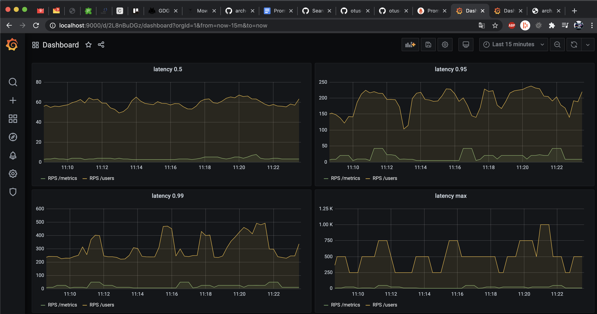
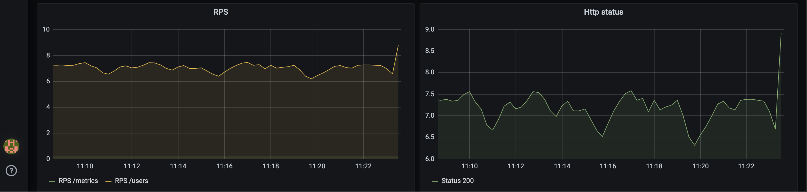
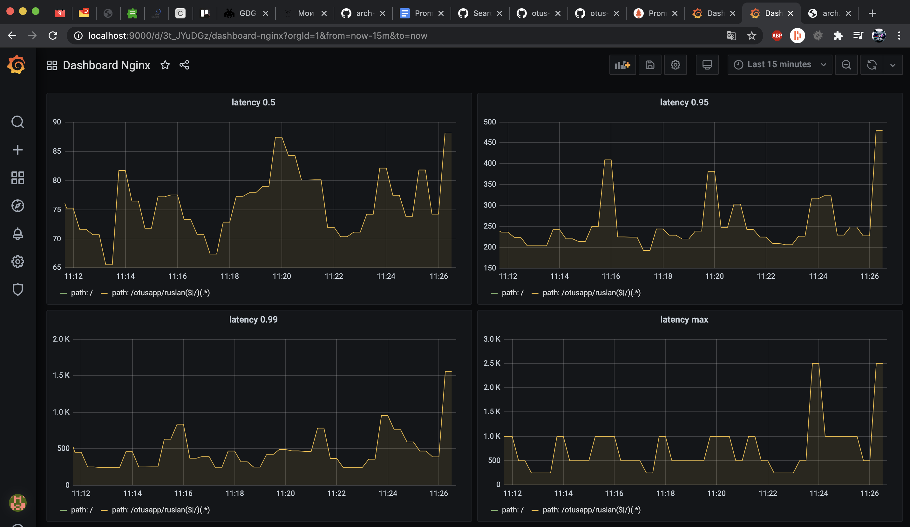
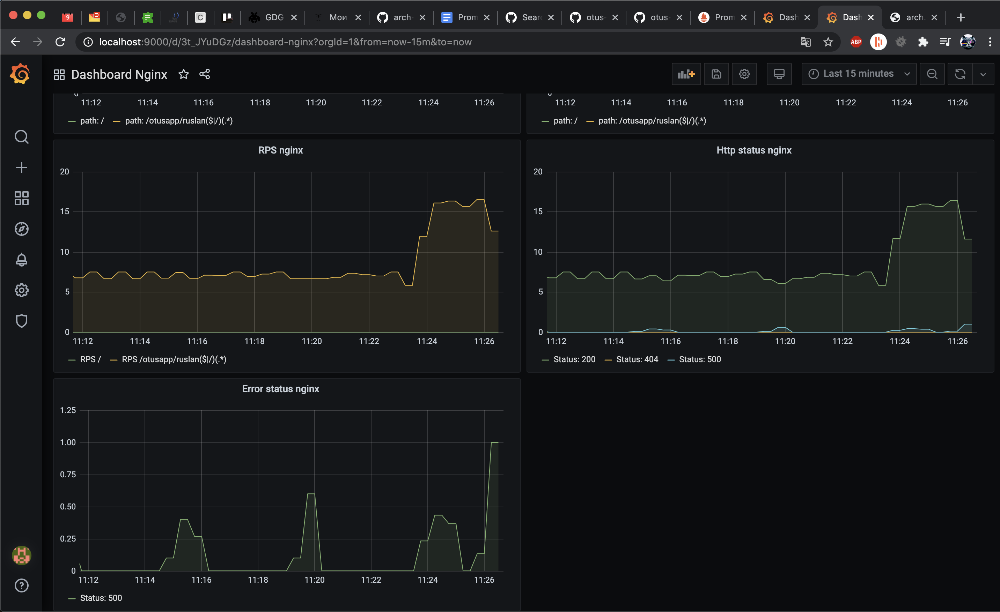
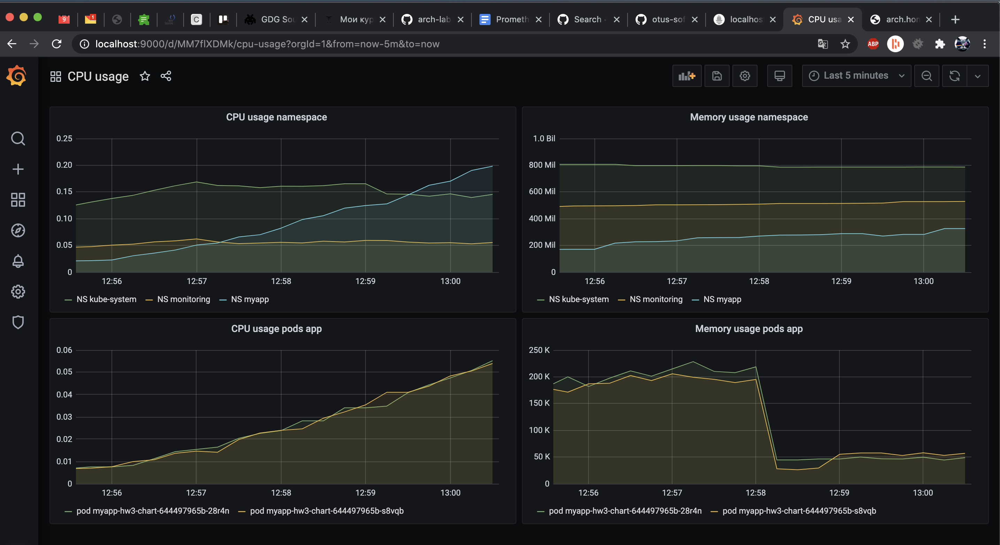
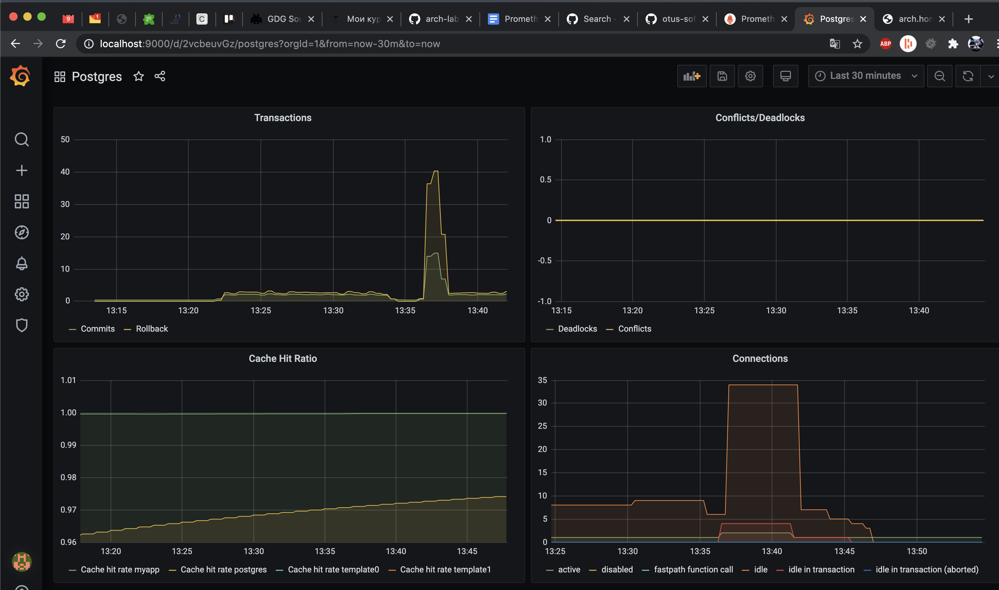
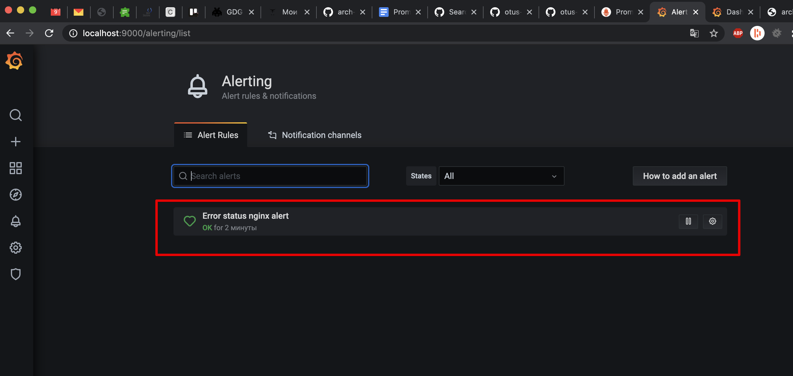

# otus-softwarearchitect

## HW-3 
Мониторинг приложения (Prometheus и Grafana)

### Запуск приложения
 - `sh start.sh`

### Скриншот Latency

### Скриншот RPS и Html statuses

### Скриншот Nginx Latency

### Скриншот Nginx RPS, http statuses и errors

### Скриншот CPU, Memory usage

### Скриншот Postgres

### Скриншот Настройка алертинга

### Dashboards
 - [Latency and RPS (app metrics)](dashboards/dashboard.json)
 - [CPU and Memory usage](dashboards/dashboard_cpu_and_memory.json)
 - [Nginx ingress metrics](dashboards/dashboard_nginx.json)
 - [Postgres metrics](dashboards/dashboard_pg.json)