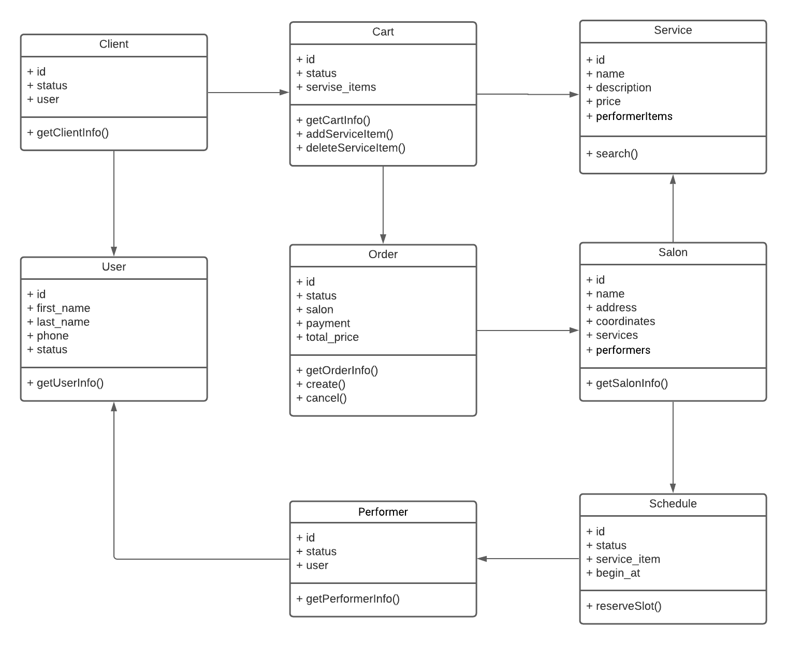

# HW-8
Паттерны декомпозиции микросервисов

## Пользовательский сценарий
- Есть авторизованный клиент
- И есть сервис записи в салоны  красоты
- И клиент вводит в строке поиска услугу "Мужская стрижка"
- Тогда появляется список салов подходящих под запрос клиента
- И в карточке салона пользователь видит 
    - Название
    - Изображение
    - Адрес ближайшей локации
    - Цена услуги
    - Рейтинг салона
- Когда клиент нажимает на карточку салона
- Тогда клиент переходит на страничку с описанием салона и его услуг
- Когда клиент нажимает на кнопку "Добавить услугу"
- Тогда услуга добавляется в корзину
- Когда клиент переходит в корзину
- Тогда он видит список всех добавленных в корзину услуг салона
- Когда клиент нажимает на кнопку "Записаться"
- Тогда появляется форма записи, которая предлагает выбрать доступную дату и время записи, и перейти к оплате
- Когда клиент выбирает доступную дату и время, способ оплаты и переходит к оплате
- Тогда возникает ворма оплаты
- Когда клиент оплачивает заказ 
- Тогда появляется окно "Заказ оплачен"
- И клиенту приходит сообщение на телефон с деталями заказа
- И заказ резервирует дату и время на услуги в салоне
- И в салон поступает заявка на выполнение услуг

## Системные действия
- Клиент ищет салон по выбранным параметрам
- Клиент получает данные о салонах
- Клиент кладет услугу в корзину
- Клиент может положить несколько услуг салона в одну корзину
- Клиент может убрать услугу из корзины
- Клиент может оформить заказ
- Клиент бронирует дату и время 
- Клиент может выбирать исполнителя каждой услуги
- Клиент выбирает способ оплаты в заказе
- Клиент проводит оплату заказа
- Приложение резервирует время мастеров салона

## Моделирование на основе OOP
### Верхнеуровневые сущности
- Клиент
- Салон
- Услуга
- Корзина
- Заказ
- Исполнитель
- График

### Нулевая итерация модели предметной области и системные действия

### Определение границ по DDD
Выделенные сервисы вокруг агрегатов:
- Клиент
- Корзина
- Заказ
- Услуга
- Поставщик
- Исполнитель
- График

## Описание сервисов

#### Название:
Услуга
#### Запросы:
- Поиск услуги `GET /api/v1/search/?q=`
#### Команды:
#### События:
#### Зависимости:
- Получить информацию об локации из сервиса Провайдер

#### Название:
Корзина
#### Запросы:
- Список услуг в корзине 
    - `GET /api/v1/cart/services/{...}`
#### Команды:
- Изменение состава услуг в корзине 
    - `POST /api/v1/cart/services/{id}`
    - `DELETE /api/v1/cart/services/{id}`
#### События:
#### Зависимости:
- Получить информацию об услуге из сервиса Услага

#### Название:
Заказ
#### Запросы:
- Получить текущий заказ 
    - `GET /api/v1/orders/current/{...}`
- Получить список прошлых заказов
    - `GET /api/v1/orders/[{...}]`
#### Команды:
- Создать заказ 
    - `POST /api/v1/orders/{...}`
- Отменить заказ 
    - `DELETE /api/v1/orders/current`
#### События:
- Заказ оплачен (оформлен) `OrderCreated(id}`
#### Зависимости:
- Нужно получить список услуг с количеством из корзины
- Получить цены услуг из сервиса Услага
- Получить информацию об локации из сервиса Провайдер
- Зарезервировать слоты из сервиса График
